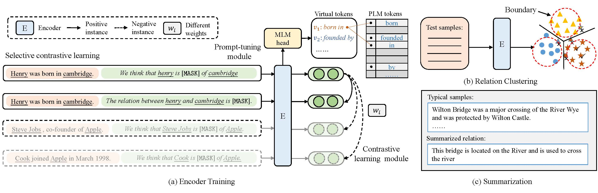

# SCL: Selective Contrastive Learning for Data-driven Zero-shot Relation Extraction

# Running The Code
## Dependency
Some important packages are listed as follows.
```
python == 3.7
pytorch == 1.13.1
transformers == 4.22.2
numpy == 1.21.6
```
The basic framework is from paper [RCL: Relation Contrastive Learning for Zero-Shot Relation Extraction](https://aclanthology.org/2022.findings-naacl.188/). 
## Data 
We have provided the original data of fewrel wikizsl and tacred which are widely used for relation extraction.

We also provide the process tools to generate data split for our model in ``./dataset`` file. For example, if you want 
to process fewrel dataset, you can run ``process_fewrel.py`` directly.

**Note:** There is a key hyper-parameter ``--ks`` which means k-shot. In experiments, we set ``--ks`` in ``[5, 50, 100, 200, Full]``.


## Training \& Evaluation
The training script is very straightforward, and follow the same structure.
Looking at `scl_main.py` as a concrete example, all you need to do are to change the parameters in argumentparser and run the code:
```python
python scl_main.py --dataset FewRel --unseen_nums 20 --shot full
```
If you finish the training and have saved the checkpoint on your device, you can evaluate the model as follows:
```python
python scl_main.py --dataset FewRel --unseen_nums 20 --shot full --do_train False
```
## OOD detection
After the evaluation on the test set, we can save the sentence embeddings, labels and predictions on your device. Find the
corresponding ``.py`` file in ``OOD_plots`` file folder. For example:
```python
python FewRel_OOD_F1.py
```
It means, you calculate the F1 varations on FewRel when using different OOD boundaries.

# Citations
If you found this paper useful, citing the paper and dataset would be greatly appreciated after the paper is accepted.


